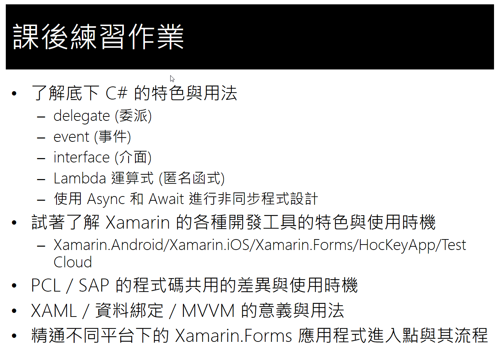

# Day1 課後作業

了解與孰悉底下 C# 的特色與用法

* delegate (委派) 
 
  [https://docs.microsoft.com/zh-tw/dotnet/csharp/language-reference/keywords/delegate](https://docs.microsoft.com/zh-tw/dotnet/csharp/language-reference/keywords/delegate)

* event (事件) 

  [https://docs.microsoft.com/zh-tw/dotnet/csharp/language-reference/keywords/event](https://docs.microsoft.com/zh-tw/dotnet/csharp/language-reference/keywords/event)

* interface (介面)
 
   [https://docs.microsoft.com/zh-tw/dotnet/csharp/language-reference/keywords/interface](https://docs.microsoft.com/zh-tw/dotnet/csharp/language-reference/keywords/interface)
* Lambda 運算式 (匿名函式)

  [https://docs.microsoft.com/zh-tw/dotnet/csharp/programming-guide/statements-expressions-operators/lambda-expressions](https://docs.microsoft.com/zh-tw/dotnet/csharp/programming-guide/statements-expressions-operators/lambda-expressions)

* 使用 Async 和 Await 進行非同步程式設計

  [https://docs.microsoft.com/zh-tw/dotnet/csharp/programming-guide/concepts/async/index](https://docs.microsoft.com/zh-tw/dotnet/csharp/programming-guide/concepts/async/index)

試著了解 Xamarin 的各種開發工具的特色與使用時機
* Xamarin.Android/Xamarin.iOS/Xamarin.Forms/HocKeyApp/Test Cloud

* PCL / SAP 的程式碼共用的差異與使用時機

* XAML / 資料綁定 / MVVM 的意義與用法

* 精通不同平台下的 Xamarin.Forms 應用程式進入點與其流程
