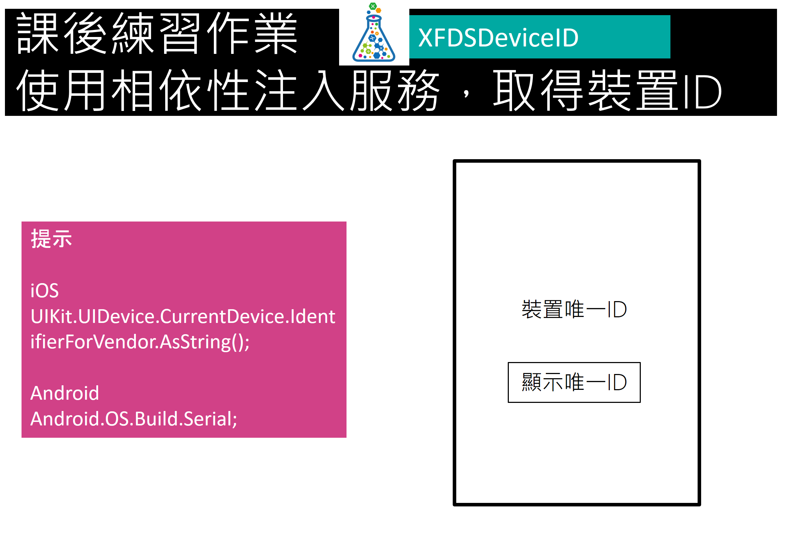
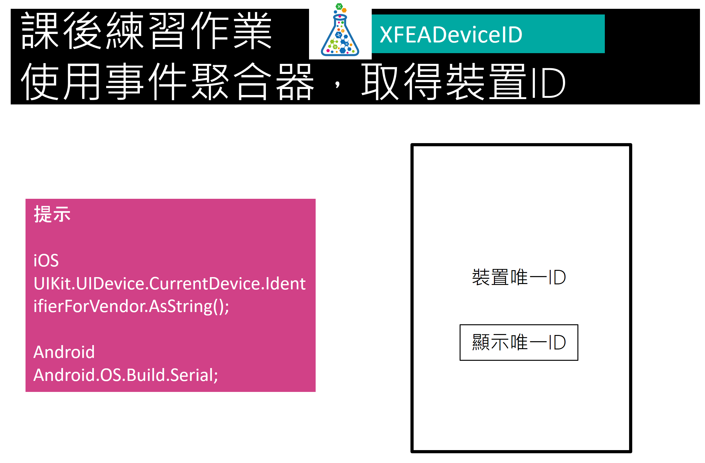

# Day3 課後作業

## 作業1

 

完成上述圖片需求的應用專案開發，當使用者點選了 `顯示唯一ID` 按鈕之後，您需要使用相依性注入服務，在各原生平台，使用平台專屬的 API，取得這台裝置的唯一ID，並且顯示在螢幕上。

提示：請在 PCL 平台下，建立一個介面，接著在原生平台下，實作這個介面，最後，在 ViewModel 內，使用建構式注入的方法，將這個介面實作物件注入到 ViewModel 內。

## 作業2

 

完成上述圖片需求的應用專案開發，當使用者點選了 `顯示唯一ID` 按鈕之後，您需要使用事件聚合器，在各原生平台，使用平台專屬的 API，取得這台裝置的唯一ID，並且發佈該事件訊息，而在 PCL 專案內，需要訂閱這個事件，當取得這個 唯一ID 之後，並且顯示在螢幕上。

提示：請在 PCL 平台下，建立事件聚合器需要用到的關注事件類別與其類別需要的 Payload。

