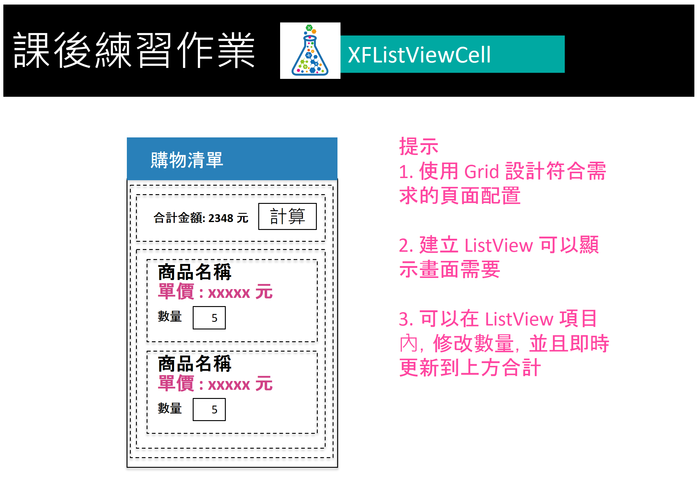
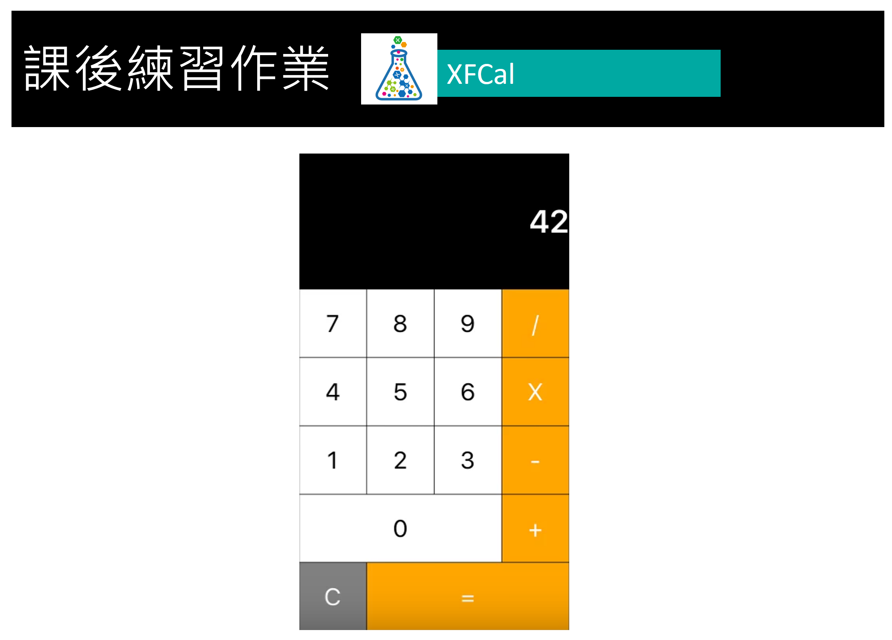
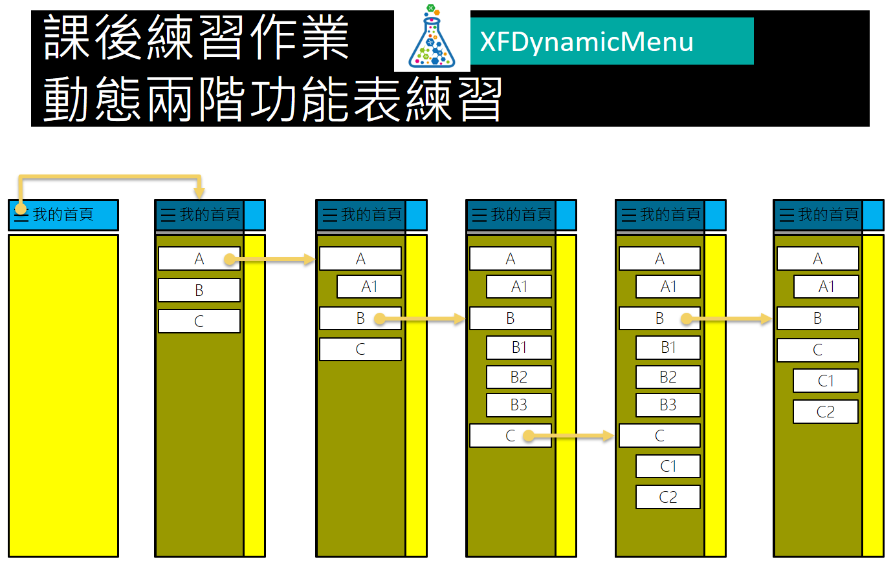

# Day4 課後作業

## 作業1

 

完成上述圖片需求的應用專案開發，在這裡需要設計一個可以顯示集合資料的 ListView 的控制項，在每筆紀錄中，使用者可以使用 Entry 來輸入購物車的數量，最後，當使用者點選上方的 `計算` 按鈕之後，會顯示該購物車的合計總金額。

在這裡，您首先需要設計一個購物車每筆記錄的資料模型類別，接著在 ViewModel 內，自動產生該購物車的靜態測試資料。

這個專案將會測試您對於資料綁定、BindingContext等觀念與技術上實作能力。

## 作業2

 

完成上述圖片需求的應用專案開發，請使用 Grid 版面配置，設計出如需求的畫面。另外，當使用者按下任一按鈕的時候，最上方會出現所按下的數字按鈕。

如果可以的話，可以實作出單字數字的加減乘除功能。

## 作業3

完成上述圖片需求的應用專案開發，在這裡需要完成一個導航抽屜功能表的應用，這個抽屜功能表清單中，提供了兩階層的功能表選項，當點選了第一個階層，此時，該第二階層的子功能表就會顯示出來，並且這些子功能表項目是可以被點選，且執行適當的指派工作；若再點選一次這個功能表項目，此時，相關的子功能表項目就會隱藏起來。

若全部的子功能表項目都展開，且超過螢幕高度的後，該如何設計呢？
