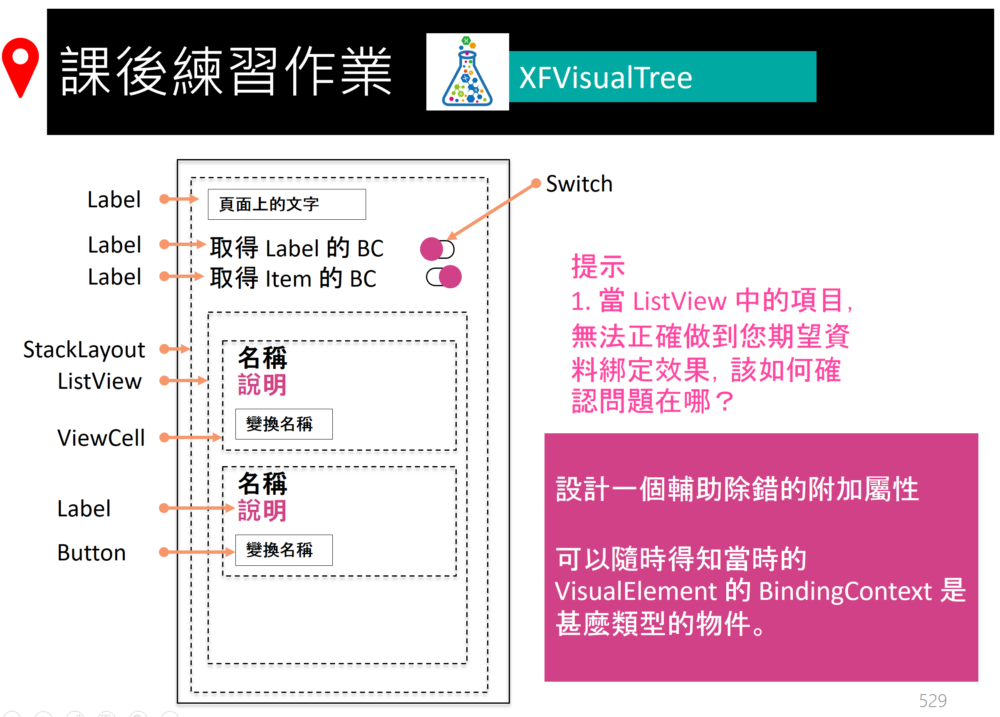

# Day5 課後作業

## 作業1

 

完成上述圖片需求的應用專案開發，在這裡需要設計一個附加屬性；當把這個附加屬性綁定到某個控制項上，您就可以從 Visual Studio 輸出的視窗中，查看到該控制項與其 Visual tree 上的每個控制項與其正在使用 BindingContext 的物件型別。

這個附加屬性對於實際專案開發的時候，當產生資料綁定無法正常運作的時候，可以透過這個附加屬性，查看到控制項的 BindingContext 的物件型別，確認當時的資料綁定物件是否是您所要的物件。

